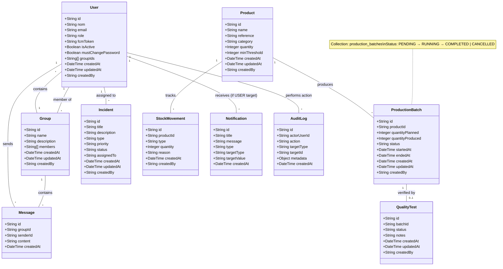

# System Class Diagram

This document presents the class diagram for the SCE-SICMS backend, illustrating the core entities, their attributes, and relationships as implemented in the Firestore database.

## Key Relationships and Logic

### 1. User & Group (Many-to-Many)
The system implements a bidirectional many-to-many relationship. 
- **Users** store a list of `groupIds` they belong to.
- **Groups** store a list of user `members` IDs.
- Services ensure these are kept in sync during creation, update, and deletion.

### 2. ProductionBatch & Product
- Each **ProductionBatch** (Firestore collection: `production_batches`) is linked to a specific **Product** via `productId`.
- The batch follows a strict lifecycle: `PENDING → RUNNING → COMPLETED` (or `CANCELLED`).
- On completion, a **StockMovement** of type `IN` is automatically created, and the product's `quantity` is updated within a Firestore transaction.
- `startedAt` is set when a batch transitions to `RUNNING`, `endedAt` when it reaches `COMPLETED` or `CANCELLED`.

### 3. Quality & ProductionBatch
- **QualityTests** are performed on production batches via `batchId` (referencing a **ProductionBatch**).
- A test results in either a `PASSED` or `FAILED` status, which influences the final availability of the produced items.

### 4. Stock Management
- **StockMovements** (IN/OUT) update the `quantity` of a **Product**.
- When `quantity` falls below `minThreshold`, alerts are typically triggered via the notification system.

### 5. HSE (Health, Safety, and Environment)
- **Incidents** are reported by users and can be assigned to a specific user (`assignedTo`) for resolution.
- They track `priority` (LOW to CRITICAL) and `status` (OPEN to RESOLVED).

### 6. Communication
- **Messages** are scoped to a **Group**, enabling real-time collaboration between members.
- **Notifications** can be targeted at a specific **User**, a **Role**, or **ALL** users.

### 7. Governance
- All sensitive actions are logged in the **AuditLog** collection, capturing the actor, target, action, and metadata for security and tracing.
